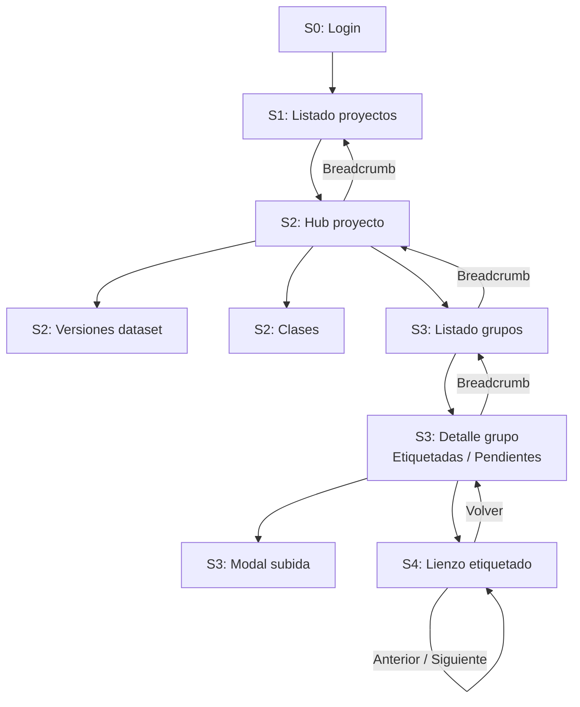
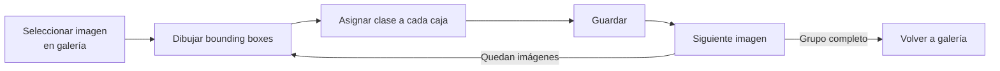
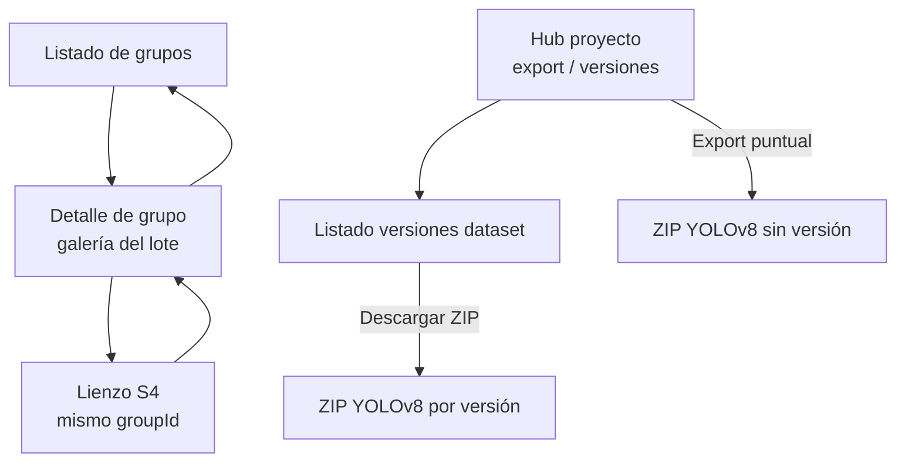

# Arquitectura de secciones y pantallas — RoboLabel

> **Versión:** 0.6 · **Fecha:** 2026-04-11 · **Estado:** borrador activo

Documento de referencia para la **organización de la aplicación web** (React): secciones de alto nivel, pantallas concretas, flujos de navegación y convenciones de rutas. Alineado con el [PRD](./PRD.md).

**Prototipos HTML de referencia:**

| Pantalla | Archivo |
|----------|---------|
| Galería de imágenes (S4) | [`ejemplo-galeria-imagenes-etiquetado.html`](./ejemplos/frontend/ejemplo-galeria-imagenes-etiquetado.html) |
| Lienzo de etiquetado (S5) | [`ejemplo-ui-etiquetado.html`](./ejemplos/frontend/ejemplo-ui-etiquetado.html) |

---

## 1. Principios de navegación

| Principio | Descripción |
|-----------|-------------|
| **Contexto por empresa** | Tras autenticarse, el usuario opera dentro de su empresa. En v1 cada usuario pertenece a una sola empresa, por lo que el contexto se fija automáticamente. |
| **Jerarquía clara** | Empresa → **Proyectos** → **Grupo** → **Imagen** → **Etiquetado**. Las rutas y breadcrumbs reflejan esta jerarquía. |
| **Grupo fijo por imagen** | Cada imagen **permanece en el grupo donde se subió** (sin mover entre grupos en v1). La UI no ofrece “cambiar de grupo” para un fichero ya cargado. |
| **Trabajo por lotes (grupos)** | La **sección de grupos** es el punto de entrada para etiquetar por lote: listado de grupos con progreso, detalle del grupo con galería y acceso al lienzo; las imágenes completadas **integran** el dataset exportable del proyecto (ver [PRD](./PRD.md) §3.2.1). |
| **Versiones de dataset** | Los **cortes nombrados** del dataset (lista de imágenes congelada + ZIP descargable) se gestionan en la pantalla de versiones del proyecto; no sustituyen el flujo de etiquetado ni mueven imágenes entre grupos ([PRD](./PRD.md) §3.9). |
| **Escritorio primero** | El lienzo de etiquetado y la revisión de lotes priorizan viewport ≥ 1280 px; el resto de vistas puede ser razonablemente responsive. |
| **Flujo sin interrupciones** | Dentro del etiquetado, el usuario navega entre imágenes del **mismo** grupo sin volver al listado. |

---

## 2. Mapa de secciones (nivel aplicación)

### 2.1 Layout general (App Shell)

```
┌──────────────────────────────────────────────────────────────────┐
│  Cabecera: logo · nombre empresa · breadcrumb · avatar/usuario   │
├──────────────┬───────────────────────────────────────────────────┤
│  Navegación  │  Área de contenido                                │
│  lateral     │  (pantallas descritas en §3–§8)                   │
│  (sidebar)   │                                                   │
│              │                                                   │
└──────────────┴───────────────────────────────────────────────────┘
```

- **Cabecera fija:** logo de RoboLabel, nombre de la empresa activa, breadcrumb contextual (Proyecto > Grupo > Imagen), menú de usuario (perfil, cerrar sesión).
- **Sidebar colapsable:** enlaces a Proyectos, Administración (si admin). Se oculta completamente en la pantalla de etiquetado para maximizar el lienzo.
- **Breadcrumb:** siempre visible excepto en login. Permite retroceder a cualquier nivel de la jerarquía.

### 2.2 Secciones

| ID | Sección | Rol principal | Fase |
|----|---------|---------------|------|
| **S0** | Autenticación | Entrar, recuperar contraseña | MVP |
| **S1** | Proyectos | CRUD y listado de proyectos | MVP |
| **S2** | Detalle de proyecto | Hub: metadatos, clases, acceso a grupos, **versiones de dataset** y exportación | MVP |
| **S3** | Grupos e imágenes | **Sección de trabajo por grupos:** gestión de grupos, subida por lote (permanente en ese grupo), filtrado etiquetadas/pendientes, progreso por grupo hacia el dataset del proyecto | MVP |
| **S4** | Etiquetado | Lienzo de bounding boxes sobre imagen | MVP |
| **S5** | Administración | Usuarios, roles, invitaciones por empresa | v1.1 |
| **S6** | Errores globales | Pantallas 404, 403, error genérico | MVP |

---

## 3. S0 — Autenticación

| Pantalla | Ruta | Descripción |
|----------|------|-------------|
| **Inicio de sesión** | `/login` | Email + contraseña. Enlace a recuperación. Redirección a `/projects` tras éxito. |
| **Recuperación de contraseña** | `/forgot-password` | Solicitar enlace de reset por email. |
| **Reset de contraseña** | `/reset-password/:token` | Formulario con nueva contraseña. |

**Comportamiento:**
- Si el usuario ya tiene sesión válida (JWT), redirigir automáticamente a `/projects`.
- Token expirado o inválido: mostrar mensaje de error con enlace para solicitar uno nuevo.

*Opcional post-MVP:* perfil de usuario (`/profile`), cambio de contraseña.

---

## 4. S1 — Proyectos

| Pantalla | Ruta | Descripción |
|----------|------|-------------|
| **Listado de proyectos** | `/projects` | Vista principal post-login. Tarjetas con: nombre, tipo, fecha de actualización, contadores (grupos, imágenes). Paginación. |
| **Crear proyecto** | `/projects/new` | Formulario: nombre (obligatorio), descripción (opcional). Tipo fijo en v1 (detección). |
| **Editar proyecto** | `/projects/:projectId/edit` | Editar nombre y descripción. Acción de archivar/eliminar (soft delete con confirmación). |

**Componentes clave:**
- Tarjeta de proyecto: nombre, badge de tipo, última actualización, contadores rápidos.
- Estado vacío: CTA "Crear tu primer proyecto" con ilustración.
- Buscador opcional por nombre de proyecto.

---

## 5. S2 — Detalle de proyecto

| Pantalla | Ruta | Descripción |
|----------|------|-------------|
| **Hub del proyecto** | `/projects/:projectId` | Nombre, descripción, estadísticas (total imágenes, etiquetadas, pendientes). Resumen opcional **por grupo** (p. ej. barras o tabla: nombre del grupo, % completado). Acceso directo a **Grupos** (etiquetado por lotes), **Clases** y **Versiones de dataset**. Acciones: **Exportar dataset (YOLOv8, ZIP)** —export puntual— (ver [PRD](./PRD.md) §3.8): modal o panel con **filtro por grupo(s)** y, opcionalmente, **aumentos**; y **Nueva versión de dataset** —mismos filtros/opciones pero crea un registro versionado ([PRD](./PRD.md) §3.9). |
| **Gestión de clases** | `/projects/:projectId/classes` | Lista de clases con color asignado. CRUD: crear (nombre + color), editar, eliminar (con advertencia si hay anotaciones asociadas). |
| **Versiones de dataset** | `/projects/:projectId/dataset-versions` | Lista de versiones del proyecto: nombre, fecha, recuento de imágenes incluidas, estado del ZIP (pendiente / listo / error). CTA **Nueva versión** (wizard con filtros + opciones de aumento alineadas al export). Acciones **Descargar** y **Eliminar** (si aplica). |
| **Detalle de versión (opcional)** | `/projects/:projectId/dataset-versions/:versionId` | Solo lectura: metadatos, notas, listado paginado de imágenes incluidas en esa versión y enlace de descarga. |

**Alternativa de implementación:** las clases y las versiones pueden integrarse como pestañas dentro del hub en vez de rutas separadas.

**Componentes clave:**
- Panel de resumen con contadores (similar a las stats del prototipo de galería).
- Lista de clases con swatch de color, nombre y conteo de anotaciones que la usan.
- Botón o menú **Exportar YOLOv8 (ZIP)** visible para roles con permiso (ver PRD §4.2); el backend expone el recurso (p. ej. `GET /api/v1/projects/{id}/export/yolov8/` o `POST` con cuerpo JSON si hay muchos parámetros) devolviendo `application/zip` o un job asíncrono con URL de descarga. Parámetros: filtros (`group_ids`, `status`, etc.) y lista opcional de **aumentos**.
- Entrada **Versiones de dataset**: tabla resumida; **crear versión** llama a `POST /api/v1/projects/{id}/dataset-versions/`; **descargar** usa `GET .../dataset-versions/{versionId}/export/yolov8/` (o URL firmada del artefacto almacenado).

---

## 6. S3 — Grupos e imágenes (etiquetado por lotes)

Esta sección es el **centro operativo para ir etiquetando grupo a grupo** e **integrar** imágenes completadas al conjunto exportable del proyecto (mismas clases en todo el proyecto; ver [PRD](./PRD.md) §3.2.1).

| Pantalla | Ruta | Descripción |
|----------|------|-------------|
| **Listado de grupos** | `/projects/:projectId/groups` | Crear grupo (nombre), renombrar, eliminar (con confirmación). Cada tarjeta muestra nombre, total de imágenes y barra de progreso (% etiquetadas / completadas). Sirve para **elegir en qué lote** trabajar y ver avance respecto al dataset del proyecto. |
| **Detalle de grupo** | `/projects/:projectId/groups/:groupId` | Vista principal del **lote**: grid de miniaturas con filtro por estado: **Todas**, **Etiquetadas**, **Pendientes**. Buscador por nombre. Contadores por pestaña. Todas las imágenes mostradas **pertenecen siempre a este grupo** (no hay selector para moverlas a otro grupo). |
| **Subida de imágenes** | (Modal o zona en detalle de grupo) | Drag-and-drop o selector de archivos **hacia el grupo actual**. Barra de progreso por archivo. Mensajes de error individuales (formato inválido, tamaño excedido). Cada archivo subido **queda registrado en este grupo** de forma permanente (véase PRD §3.2). |

**Referencia visual:** ver prototipo [`ejemplo-galeria-imagenes-etiquetado.html`](./ejemplos/frontend/ejemplo-galeria-imagenes-etiquetado.html).

**Componentes clave:**
- Tarjeta de imagen: miniatura (4:3), nombre, badge de estado (Etiquetada / Pendiente / En progreso), conteo de anotaciones.
- Filtros como tabs (Todas | Etiquetadas | Pendientes) con contadores.
- Estado vacío por grupo: CTA "Subir imágenes".
- Clic en miniatura → abre pantalla de etiquetado (S4) **dentro del mismo grupo** (`groupId` fijo en la ruta).
- Copy opcional en UI: texto breve del tipo “Las imágenes permanecen en este grupo; el dataset del proyecto se arma con las que marques como completadas” (alineado a PRD).

---

## 7. S4 — Etiquetado (detección)

| Pantalla | Ruta | Descripción |
|----------|------|-------------|
| **Lienzo de etiquetado** | `/projects/:projectId/groups/:groupId/annotate/:imageId` | Vista principal de trabajo: imagen + herramientas + panel de anotaciones. |

**Referencia visual:** ver prototipo [`ejemplo-ui-etiquetado.html`](./ejemplos/frontend/ejemplo-ui-etiquetado.html).

### 7.1 Distribución del lienzo

```
┌─────────────────────────────────────────────────────────────────────┐
│  Toolbar: clase activa · nueva clase · zoom · pan · guardar · nav   │
├──────────────────────────────────────────────────┬──────────────────┤
│                                                  │  Panel lateral   │
│            Lienzo (canvas + SVG overlay)          │  ─ Clase rápida  │
│            - Imagen con zoom/pan                  │  ─ Clase de caja │
│            - Bounding boxes dibujables            │  ─ Lista objetos │
│            - Handles de redimensionado            │  ─ Eliminar      │
│                                                  │                  │
├──────────────────────────────────────────────────┴──────────────────┤
│  Barra de estado: N objeto(s) · zoom X% · estado guardado          │
└─────────────────────────────────────────────────────────────────────┘
```

### 7.2 Funcionalidades del lienzo

| Funcionalidad | Interacción |
|---------------|-------------|
| Dibujar bounding box | Arrastrar sobre la imagen (cursor crosshair) |
| Seleccionar caja | Clic sobre una caja existente o en la lista lateral |
| Mover caja | Arrastrar caja seleccionada |
| Redimensionar | Arrastrar handles (8 puntos: esquinas + medios) |
| Eliminar caja | Tecla Delete/Backspace o botón en panel lateral |
| Cambiar clase | Selector en panel lateral (caja seleccionada) |
| Zoom | Rueda del ratón o botones +/- |
| Pan (desplazar vista) | Shift + arrastrar, o botón central del ratón |
| Crear clase rápida | Input en panel lateral (Enter) o botón en toolbar |

### 7.3 Navegación entre imágenes

- Botones **anterior / siguiente** en el toolbar para moverse dentro del **mismo grupo**.
- Atajos sugeridos: `←` anterior, `→` siguiente.
- Al cambiar de imagen: guardar automáticamente si hay cambios sin guardar (o pedir confirmación).

### 7.4 Indicadores de estado

| Indicador | Ubicación |
|-----------|-----------|
| "Sin guardar" / "Guardado" | Barra de estado inferior |
| Conteo de objetos | Barra de estado inferior |
| Nivel de zoom | Barra de estado inferior |
| Estado de la imagen (pending/in_progress/completed) | Toolbar o breadcrumb |

---

## 8. S5 — Administración (empresa)

| Pantalla | Ruta | Descripción |
|----------|------|-------------|
| **Usuarios de la empresa** | `/settings/members` | Listado de usuarios con rol. Invitar nuevo usuario (email + rol). |
| **Editar rol de usuario** | (Modal sobre listado) | Cambiar rol: Admin, Editor, Visualizador. |

**Fase:** v1.1. En MVP, la gestión de usuarios se realiza por admin de Django o por seed de datos.

---

## 9. S6 — Pantallas de error y estados globales

| Pantalla | Ruta / Trigger | Descripción |
|----------|---------------|-------------|
| **404 — No encontrado** | Ruta inexistente o recurso eliminado | Mensaje amigable + enlace a Proyectos |
| **403 — Sin permisos** | Acceso a recurso de otra empresa o sin rol suficiente | Mensaje + enlace a Proyectos |
| **Error genérico** | Error de servidor (5xx) | Mensaje de disculpa + reintentar |

---

## 10. Flujos entre pantallas

### 10.1 Flujo principal (happy path)



### 10.2 Flujo de etiquetado por imagen



### 10.3 Flujo por grupos e integración al dataset

- El usuario recorre **grupos** en `/projects/:projectId/groups`; en cada **detalle de grupo** etiqueta hasta dejar imágenes en `completed`.
- Las imágenes `completed` **suman** al agregado exportable del proyecto (dataset lógico); no hace falta cerrar todos los grupos para **exportar** desde el hub (con filtros de estado y, en implementación, de grupo).
- La **pertenencia** de cada archivo al grupo no cambia: integrar al dataset es **marcar progreso y exportar**, no mover imágenes entre grupos.



---

## 11. Tabla de rutas consolidada

| Ruta | Sección | Pantalla | Auth requerida |
|------|---------|----------|----------------|
| `/login` | S0 | Inicio de sesión | No |
| `/forgot-password` | S0 | Recuperar contraseña | No |
| `/reset-password/:token` | S0 | Reset de contraseña | No |
| `/projects` | S1 | Listado de proyectos | Sí |
| `/projects/new` | S1 | Crear proyecto | Sí |
| `/projects/:projectId` | S2 | Hub del proyecto | Sí |
| `/projects/:projectId/dataset-versions` | S2 | Listado y creación de versiones de dataset | Sí |
| `/projects/:projectId/dataset-versions/:versionId` | S2 | Detalle de versión (opcional) | Sí |
| `/projects/:projectId/edit` | S1 | Editar proyecto | Sí |
| `/projects/:projectId/classes` | S2 | Gestión de clases | Sí |
| `/projects/:projectId/groups` | S3 | Listado de grupos | Sí |
| `/projects/:projectId/groups/:groupId` | S3 | Detalle de grupo | Sí |
| `/projects/:projectId/groups/:groupId/annotate/:imageId` | S4 | Lienzo de etiquetado | Sí |
| `GET` o `POST /api/v1/projects/:projectId/export/yolov8/` (query/cuerpo: `group_ids`, `status`, `augmentations` opcional, etc.) | S2 | Descarga ZIP **puntual**; filtros y aumentos opcionales alineados a [PRD](./PRD.md) §3.8 | Sí |
| `POST /api/v1/projects/:projectId/dataset-versions/` | S2 | Crea una **versión de dataset** y materializa inclusiones; puede disparar generación del ZIP ([PRD](./PRD.md) §3.9) | Sí |
| `GET /api/v1/projects/:projectId/dataset-versions/` | S2 | Lista versiones del proyecto | Sí |
| `GET /api/v1/projects/:projectId/dataset-versions/:versionId/export/yolov8/` | S2 | Descarga el ZIP de una **versión** concreta | Sí |
| `/settings/members` | S5 | Usuarios (v1.1) | Sí (admin) |
| `*` | S6 | 404 | — |

---

## 12. Estados de UI transversales

| Estado | Dónde aplica | Comportamiento |
|--------|-------------|----------------|
| **Cargando** | Listados, subida, carga de imagen en lienzo | Skeleton loader o spinner según contexto |
| **Vacío** | Sin proyectos, sin grupos, sin imágenes | Mensaje + CTA para crear/subir el primer recurso |
| **Error de red** | Cualquier llamada API | Toast de error con opción de reintentar |
| **Sin permisos** | Acciones restringidas por rol | Botón deshabilitado o tooltip explicativo |
| **Conflicto de guardado** | Lienzo de etiquetado | Indicador visual; último guardado gana (timestamp visible) |
| **Generando export ZIP** | Hub de proyecto, creación de versión (export YOLOv8) | Indicador de progreso o pantalla de espera si el backend procesa en segundo plano; si hay **filtro por grupo(s)**, mostrar resumen de qué lotes se incluyen; si hay **aumentos** activos, indicar tipos elegidos; al crear **versión**, mostrar estado del artefacto hasta que el ZIP esté listo para descarga |

---

## 13. Relación con el roadmap del PRD

| Fase | Secciones / pantallas |
|------|----------------------|
| **MVP** | S0, S1, S2 (incluye export **YOLOv8 ZIP** y **versiones de dataset**), S3, S4, S6 |
| **v1.1** | S5 (administración de usuarios), exportaciones adicionales (p. ej. COCO), mejoras en filtros |
| **v1.2** | Sin cambio funcional de pantallas; cambios de infraestructura (BD) |

---

*Documento vivo: actualizar rutas y componentes cuando se defina el enrutador de React y el design system final.*
