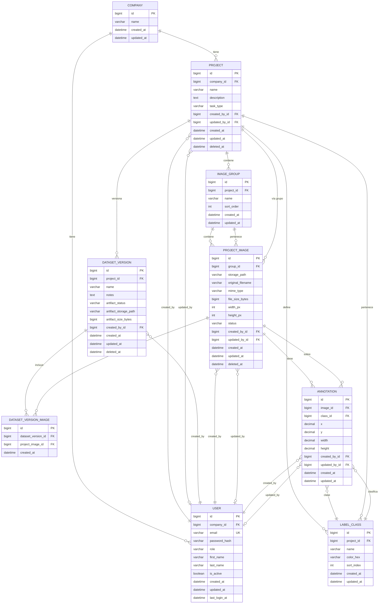

# Base de datos — RoboLabel

> **Versión:** 0.3 · **Fecha:** 2026-04-11 · **Estado:** borrador  
> **Referencia:** [PRD](./PRD.md) (multiempresa, proyectos, grupos, imágenes con **pertenencia fija al grupo**, clases, anotaciones, soft delete, trazabilidad, integración al dataset, **versiones de dataset** con membresía materializada y artefacto ZIP por versión).  
> **Compatibilidad:** esquema alineado con SQLite (desarrollo), MySQL y MariaDB (migración prevista); tipos conservadores (`VARCHAR` acotado en campos indexados, sin dependencias fuertes de funciones específicas de un motor).

---

## 1. Diagrama entidad–relación

Relaciones principales: **empresa → usuarios y proyectos**; **proyecto → grupos, clases y versiones de dataset**; **grupo → imágenes** (cada imagen se inserta con un `group_id` que **no se reasigna** en v1); **imagen → anotaciones**; cada **anotación** apunta a una **clase del mismo proyecto** que la imagen (regla de negocio en aplicación). Una **versión de dataset** (`dataset_version`) **materializa** qué imágenes entraron en ese corte mediante filas en `dataset_version_image`; el **ZIP YOLOv8** de esa versión se referencia en el registro de versión (ruta al artefacto) para descargas repetibles (PRD §3.9).

### 1.1 Notas de modelado

- `PROJECT_IMAGE.group_id` determina el proyecto a través del grupo; en implementación basta el FK al grupo; el vínculo lógico al proyecto sirve para autorización (`company → project → group → image`).
- **Pertenencia inmutable:** tras insertar una fila en `project_image`, el campo `group_id` **no debe actualizarse** a otro grupo (restricción de negocio y de API en v1). No se modela “traspaso” de imagen entre grupos.
- Las **nuevas** filas pueden añadirse al mismo grupo con subidas posteriores; siguen compartiendo `group_id`.
- Índice único recomendado: `(project_id, name)` en `LABEL_CLASS` para el nombre único por proyecto indicado en el PRD.
- **Exportación / dataset puntual:** las consultas de export YOLOv8 sin versión filtran por `project` → `image_group` (opcionalmente por IDs de grupo) → `project_image.status` y anotaciones; ver PRD §3.8.
- **Versiones de dataset:** `dataset_version` almacena metadatos y, tras generar el ZIP, **`artifact_storage_path`** (y tamaño) para re-descarga idéntica; `dataset_version_image` fija la **lista de imágenes** incluidas al crear la versión (inmutable). Los criterios de filtro usados en la creación pueden documentarse en `notes` o en campo `TEXT` adicional si se requiere trazabilidad fina (evitar `JSONField` no portable sin alternativa; ver PRD §5.3).
- Evolución opcional: tabla de **jobs de exportación** genéricos enlazados a `dataset_version_id` o `project_id`.

---

## 2. Diccionario de datos

Convenciones: tipos orientados a **Django** y a **MySQL/MariaDB**; `VARCHAR(n)` con `n` acotado para campos indexados; timestamps en UTC.

### 2.1 `company`

| Campo | Tipo | Nulo | Clave | Descripción |
|-------|------|------|--------|-------------|
| `id` | BIGINT | NO | PK | Identificador interno del inquilino. |
| `name` | VARCHAR(255) | NO | — | Nombre de la organización. |
| `created_at` | DATETIME | NO | — | Alta del registro. |
| `updated_at` | DATETIME | NO | — | Última modificación. |

**Índices:** PK en `id`.

---

### 2.2 `user` (usuario de aplicación)

| Campo | Tipo | Nulo | Clave | Descripción |
|-------|------|------|--------|-------------|
| `id` | BIGINT | NO | PK | Identificador de usuario. |
| `company_id` | BIGINT | NO | FK → `company.id` | Empresa a la que pertenece (v1: una sola empresa por usuario). |
| `email` | VARCHAR(254) | NO | UK | Correo; único en todo el sistema (login). |
| `password_hash` | VARCHAR(128) | NO | — | Hash de contraseña (p. ej. PBKDF2 de Django). |
| `role` | VARCHAR(32) | NO | — | `admin`, `editor`, `viewer` (permisos del PRD §4.2). |
| `first_name` | VARCHAR(150) | SÍ | — | Nombre. |
| `last_name` | VARCHAR(150) | SÍ | — | Apellidos. |
| `is_active` | BOOLEAN | NO | — | Permite desactivar acceso sin borrar fila. |
| `created_at` | DATETIME | NO | — | Alta. |
| `updated_at` | DATETIME | NO | — | Última actualización de perfil. |
| `last_login_at` | DATETIME | SÍ | — | Último inicio de sesión (útil para auditoría ligera). |

**Índices:** PK `id`; único `email`; índice `company_id`.

---

### 2.3 `project`

| Campo | Tipo | Nulo | Clave | Descripción |
|-------|------|------|--------|-------------|
| `id` | BIGINT | NO | PK | Identificador del proyecto. |
| `company_id` | BIGINT | NO | FK → `company.id` | Inquilino propietario. |
| `name` | VARCHAR(255) | NO | — | Nombre del proyecto. |
| `description` | TEXT | SÍ | — | Descripción libre. |
| `task_type` | VARCHAR(64) | NO | — | En v1: `object_detection`. |
| `created_by_id` | BIGINT | SÍ | FK → `user.id` | Usuario que creó el proyecto. |
| `updated_by_id` | BIGINT | SÍ | FK → `user.id` | Último editor de metadatos. |
| `created_at` | DATETIME | NO | — | Creación. |
| `updated_at` | DATETIME | NO | — | Última modificación. |
| `deleted_at` | DATETIME | SÍ | — | Soft delete; NULL = activo. |

**Índices:** PK `id`; índice compuesto `(company_id, deleted_at)` para listados filtrados; opcional `(company_id, name)` si se exige unicidad de nombre por empresa.

---

### 2.4 `image_group`

| Campo | Tipo | Nulo | Clave | Descripción |
|-------|------|------|--------|-------------|
| `id` | BIGINT | NO | PK | Identificador del grupo (batch / lote). |
| `project_id` | BIGINT | NO | FK → `project.id` | Proyecto padre. |
| `name` | VARCHAR(255) | NO | — | Nombre visible del grupo. |
| `sort_order` | INT | NO | — | Orden opcional en UI (p. ej. 0 por defecto). |
| `created_at` | DATETIME | NO | — | Creación. |
| `updated_at` | DATETIME | NO | — | Último cambio de nombre u orden. |

**Índices:** PK `id`; índice `project_id`.

**Uso en producto:** agrupa imágenes cargadas juntas o en el mismo contexto de lote; el etiquetado por grupo y el seguimiento de progreso hacia el dataset exportable se basan en este contenedor (véase PRD §3.2.1).

---

### 2.5 `label_class`

| Campo | Tipo | Nulo | Clave | Descripción |
|-------|------|------|--------|-------------|
| `id` | BIGINT | NO | PK | Identificador de la clase. |
| `project_id` | BIGINT | NO | FK → `project.id` | Proyecto al que pertenece la clase. |
| `name` | VARCHAR(255) | NO | — | Nombre único **dentro del proyecto** (p. ej. "persona"). |
| `color_hex` | VARCHAR(7) | SÍ | — | Color en UI, p. ej. `#3B82F6`. |
| `sort_index` | INT | NO | — | Orden para `data.yaml` y selectores (alineado con `class_id` YOLO). |
| `created_at` | DATETIME | NO | — | Creación. |
| `updated_at` | DATETIME | NO | — | Última edición. |

**Índices:** PK `id`; **único** `(project_id, name)`; índice `project_id`.

---

### 2.6 `project_image`

| Campo | Tipo | Nulo | Clave | Descripción |
|-------|------|------|--------|-------------|
| `id` | BIGINT | NO | PK | Identificador de la imagen. |
| `group_id` | BIGINT | NO | FK → `image_group.id` | Grupo al que pertenece; **fijado en la alta** y **no reasignable** a otro grupo en v1 (actualizaciones del campo prohibidas en API salvo migraciones técnicas controladas). |
| `storage_path` | VARCHAR(512) | NO | — | Ruta relativa estable al fichero en disco (o almacenamiento futuro). |
| `original_filename` | VARCHAR(255) | NO | — | Nombre original sanitizado para mostrar. |
| `mime_type` | VARCHAR(64) | NO | — | p. ej. `image/jpeg`, `image/png`. |
| `file_size_bytes` | BIGINT | NO | — | Tamaño del archivo. |
| `width_px` | INT | NO | — | Ancho en píxeles de la imagen original (export/normalización YOLO). |
| `height_px` | INT | NO | — | Alto en píxeles. |
| `status` | VARCHAR(32) | NO | — | `pending`, `in_progress`, `completed` (PRD §3.6). |
| `created_by_id` | BIGINT | SÍ | FK → `user.id` | Quien subió o creó el registro. |
| `updated_by_id` | BIGINT | SÍ | FK → `user.id` | Última modificación de metadatos o estado. |
| `created_at` | DATETIME | NO | — | Alta del registro. |
| `updated_at` | DATETIME | NO | — | Última actualización. |
| `deleted_at` | DATETIME | SÍ | — | Soft delete opcional de la imagen. |

**Índices:** PK `id`; índice `group_id`; índice compuesto `(group_id, status)` para pestañas etiquetadas/pendientes.

---

### 2.7 `annotation`

| Campo | Tipo | Nulo | Clave | Descripción |
|-------|------|------|--------|-------------|
| `id` | BIGINT | NO | PK | Identificador de la anotación. |
| `image_id` | BIGINT | NO | FK → `project_image.id` | Imagen anotada. |
| `class_id` | BIGINT | NO | FK → `label_class.id` | Clase del objeto. Debe corresponder a un `label_class` del mismo proyecto que la imagen (validación en capa de dominio/API). |
| `x` | DECIMAL(12,4) | NO | — | Esquina superior izquierda X en píxeles (respecto a imagen original). |
| `y` | DECIMAL(12,4) | NO | — | Esquina superior izquierda Y en píxeles. |
| `width` | DECIMAL(12,4) | NO | — | Ancho del rectángulo en píxeles. |
| `height` | DECIMAL(12,4) | NO | — | Alto del rectángulo en píxeles. |
| `created_by_id` | BIGINT | SÍ | FK → `user.id` | Creación de la caja. |
| `updated_by_id` | BIGINT | SÍ | FK → `user.id` | Última edición de geometría o clase. |
| `created_at` | DATETIME | NO | — | Alta. |
| `updated_at` | DATETIME | NO | — | Última modificación. |

**Índices:** PK `id`; índice `image_id`; índice `class_id`.

---

### 2.8 `dataset_version`

| Campo | Tipo | Nulo | Clave | Descripción |
|-------|------|------|--------|-------------|
| `id` | BIGINT | NO | PK | Identificador de la versión de dataset. |
| `project_id` | BIGINT | NO | FK → `project.id` | Proyecto al que pertenece la versión. |
| `name` | VARCHAR(255) | NO | — | Nombre visible (p. ej. `v2`, `baseline-abril`). |
| `notes` | TEXT | SÍ | — | Notas u opciones de filtro en texto libre para auditoría. |
| `artifact_status` | VARCHAR(32) | NO | — | Estado del ZIP: `pending`, `ready`, `failed` (u homólogos). |
| `artifact_storage_path` | VARCHAR(512) | SÍ | — | Ruta relativa al fichero ZIP generado cuando `artifact_status = ready`. |
| `artifact_size_bytes` | BIGINT | SÍ | — | Tamaño del ZIP en bytes. |
| `created_by_id` | BIGINT | SÍ | FK → `user.id` | Usuario que creó la versión. |
| `created_at` | DATETIME | NO | — | Creación del registro. |
| `updated_at` | DATETIME | NO | — | Última actualización (p. ej. al completar el artefacto). |
| `deleted_at` | DATETIME | SÍ | — | Soft delete opcional de la versión y política de borrado del fichero en disco. |

**Índices:** PK `id`; índice `project_id`; opcional índice `(project_id, created_at)` para listados recientes.

---

### 2.9 `dataset_version_image`

Tabla de **unión** que materializa qué imágenes forman parte de una versión **en el instante de creación** (no se modifican filas de membresía en producto salvo correcciones administrativas).

| Campo | Tipo | Nulo | Clave | Descripción |
|-------|------|------|--------|-------------|
| `id` | BIGINT | NO | PK | Identificador de la fila de inclusión. |
| `dataset_version_id` | BIGINT | NO | FK → `dataset_version.id` | Versión a la que pertenece la inclusión. |
| `project_image_id` | BIGINT | NO | FK → `project_image.id` | Imagen incluida en esa versión. |
| `created_at` | DATETIME | NO | — | Momento en que se materializó la inclusión. |

**Índices:** PK `id`; **único** `(dataset_version_id, project_image_id)`; índice `project_image_id` para consultas inversas.

**Regla:** toda `project_image_id` debe pertenecer a un grupo cuyo `project_id` coincide con `dataset_version.project_id` (validación en aplicación o integridad referencial cruzada en lógica de creación).

---

## 3. Reglas de integridad

| Regla | Cómo se aplica |
|--------|----------------|
| Aislamiento por empresa | Toda consulta parte de `request.user.company_id` y enlaza `project.company_id`, o navega proyecto → grupo → imagen. |
| Imagen siempre en su grupo de subida | Tras `INSERT` en `project_image`, no se permite `UPDATE` de `group_id` hacia otro `image_group` en flujos de producto v1; las imágenes añadidas en subidas posteriores al mismo grupo comparten ese `group_id`. |
| Clase coherente con proyecto | `annotation.class_id` → `label_class.project_id` debe coincidir con el `project_id` del grupo de `annotation.image_id`. |
| Unicidad de nombres de clase | UNIQUE `(project_id, name)` en `label_class`. |
| Orden YOLO | `label_class.sort_index` define el índice 0…N-1 usado en etiquetas `.txt` y `data.yaml` en exportación. |
| Dataset exportable (puntual) | Las consultas de export sin versión incluyen solo filas elegibles (p. ej. `project_image.status = completed`); filtros opcionales por `image_group.id` dentro del mismo `project_id`. |
| Versión de dataset | `dataset_version.project_id` alinea el corte con el proyecto; `dataset_version_image` solo referencia imágenes de ese proyecto; la membresía **no** se altera en flujos normales de usuario tras la creación. |
| Artefacto por versión | El ZIP asociado se identifica con `artifact_storage_path` cuando está listo; la re-descarga usa ese fichero para **reproducibilidad** (PRD §3.9). |

---

## 4. Documentos relacionados

| Documento | Ubicación |
|-----------|-----------|
| PRD | [`docs/PRD.md`](./PRD.md) |
| Arquitectura de secciones y pantallas | [`docs/arquitectura-secciones-pantallas.md`](./arquitectura-secciones-pantallas.md) |

---

*Documento vivo: actualizar al definir modelos Django, migraciones o tablas adicionales (p. ej. jobs de export genéricos o snapshot de anotaciones por versión).*
